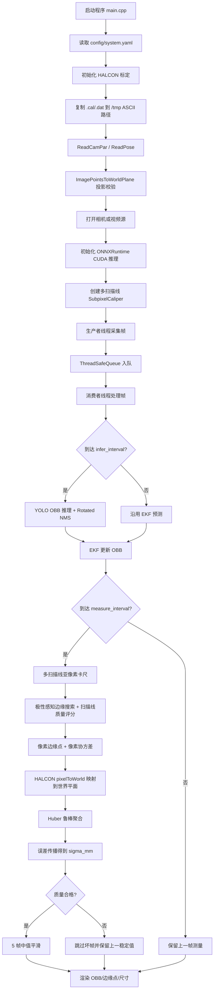
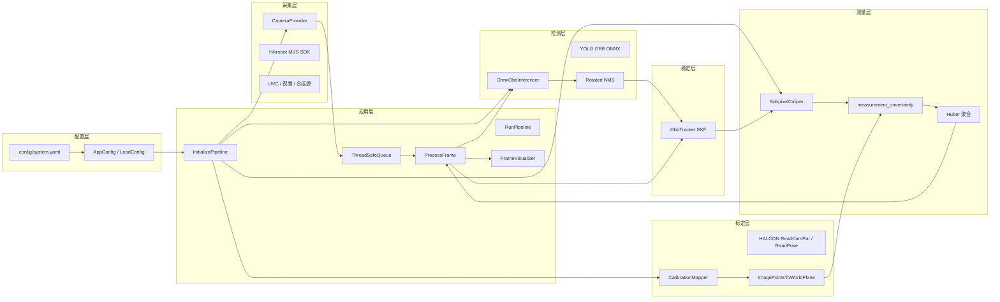

# 工业金属零件视觉测量系统分析报告

## 1. 系统概述

本系统面向工业金属零件在线尺寸测量，运行链路由 **Hikrobot 工业相机采集、YOLO OBB ONNX 推理、EKF 跟踪、多扫描线亚像素卡尺、HALCON 世界平面映射、误差传播与可视化** 组成。

系统不包含模型训练代码，重点实现推理侧和测量侧工程闭环。当前主配置为 `config/system.yaml`，推荐启动命令为：

```bash
bash scripts/run_demo.sh
```

最近一次现场运行结果示例：

```text
[HALCON] 投影校验通过: 100px -> 9.084496 mm
[ONNX] CUDA Execution Provider 已启用
窗口显示: px=353.466980, mm=32.808380, sigma=0.081995, scans=9
```

其中：

- `px`：经过平滑后的像素尺寸。
- `mm`：经过 5 帧中值平滑后的显示毫米值。
- `sigma`：由边缘协方差和世界映射雅可比传播得到的毫米标准差估计。
- `scans`：有效参与测量的平行扫描线数量。
- `LOW QUALITY`：当前帧未通过 `sigma/scans/跳变` 质量控制，当前边缘点仍会显示，但不会进入最终平滑历史。

---

## 2. 系统流程图



---

## 3. 系统架构图



模块对应源码：

| 层级 | 文件 | 作用 |
| --- | --- | --- |
| 入口 | `src/main.cpp` | 读取配置，设置日志，进入 `RunPipeline()` |
| 配置 | `src/config.cpp` / `include/config.hpp` | YAML 配置解析与合法性校验 |
| 采集 | `src/camera_provider.cpp` | MVS、UVC、视频、合成源采集 |
| 推理 | `src/onnx_inferencer.cpp` | ONNXRuntime CUDA 推理、OBB 解码、旋转 NMS |
| 跟踪 | `src/tracker_ekf.cpp` | 6 维卡尔曼滤波，输出稳定 OBB 和位姿协方差 |
| 标定 | `src/calibration.cpp` | HALCON 标定读取、像素到世界平面映射 |
| 测量 | `src/subpixel_caliper.cpp` | 多扫描线 profile、亚像素边缘定位、像素协方差 |
| 误差传播 | `src/measurement_uncertainty.cpp` | 数值雅可比、方差传播、Huber 均值 |
| 帧处理 | `src/app/frame_processor.cpp` | 单帧推理、跟踪、测量、毫米换算、平滑 |
| 可视化 | `src/app/frame_visualizer.cpp` | 画 OBB、测量点、像素/mm/sigma |

---

## 4. 数据结构与配置

核心测量结果结构位于 `include/types.hpp`：

```cpp
struct MeasurementResult {
    uint64_t frame_id = 0;
    bool valid = false;
    float pixel_distance = 0.0f;
    float world_distance_mm = -1.0f;
    float raw_world_distance_mm = -1.0f;
    float world_sigma_mm = -1.0f;
    cv::Point2f left_edge_px;
    cv::Point2f right_edge_px;
    cv::Matx22f left_edge_cov_px = cv::Matx22f::zeros();
    cv::Matx22f right_edge_cov_px = cv::Matx22f::zeros();
    int valid_scan_count = 0;
    std::vector<cv::Point2f> left_edge_samples_px;
    std::vector<cv::Point2f> right_edge_samples_px;
    std::vector<cv::Matx22f> left_edge_sample_covs_px;
    std::vector<cv::Matx22f> right_edge_sample_covs_px;
};
```

关键配置位于 `include/config.hpp` 和 `config/system.yaml`：

```cpp
float caliper_length = 80.0f;
float caliper_half_width = 8.0f;
float gaussian_sigma = 1.0f;
float caliper_search_scale = 1.25f;
bool use_obb_adaptive_caliper = true;
bool measure_long_edge = true;
int multi_scan_count = 7;
int edge_refine_half_window = 4;
float edge_power_gamma = 2.0f;
float huber_delta_mm = 0.05f;
bool estimate_measurement_uncertainty = true;
```

这些参数控制：

- `multi_scan_count`：默认 9 条平行扫描线。
- `edge_refine_half_window`：亚像素边缘 refinement 使用的梯度窗口半径。
- `edge_power_gamma`：梯度权重指数，默认平方梯度。
- `huber_delta_mm`：世界平面聚合的 Huber 截断阈值。
- `estimate_measurement_uncertainty`：是否输出 `sigma_mm`。

---

## 5. 运行流程实现

### 5.1 初始化

`src/app/pipeline_init.cpp` 中先加载标定，再打开相机和 ONNX。这样做的原因是标定是毫米测量前提，`strict_calibration=1` 时如果标定失败会直接阻止运行。

```cpp
context.calibration = std::make_unique<CalibrationMapper>();
const bool calibration_loaded =
    (!cfg.calibration_file.empty() &&
     context.calibration->load(cfg.calibration_file,
                               cfg.frame_width,
                               cfg.frame_height,
                               cfg.focal_length_mm,
                               cfg.pixel_size_um));

if (cfg.strict_calibration && !context.calibration->canMeasureInMm()) {
    logger::Error("错误: strict_calibration=1 但当前标定无法完成毫米换算。");
    return false;
}

context.camera = std::make_unique<CameraProvider>(cfg.input_source,
                                                  cfg.frame_width,
                                                  cfg.frame_height);
context.inferencer = std::make_unique<OnnxObbInferencer>(
    cfg.onnx_model_path, cfg.conf_threshold, cfg.nms_threshold);
```

### 5.2 生产者/消费者并发

`src/app/pipeline_runner.cpp` 使用一个采集线程和一个处理线程，通过 `ThreadSafeQueue<FrameData>` 解耦。

```cpp
std::thread producer([&]() {
    uint64_t fid = 0;
    while (!stop_requested.load()) {
        FrameData frame;
        if (!context.camera->read(frame, fid)) {
            break;
        }
        queue.push(std::move(frame));
        ++fid;
    }
    queue.close();
});

std::thread consumer([&]() {
    FrameProcessorState state;
    while (true) {
        auto frame_opt = queue.pop();
        if (!frame_opt.has_value()) {
            break;
        }
        ProcessFrame(std::move(frame_opt.value()), cfg, context,
                     state, stop_requested, queue);
    }
});
```

---

## 6. 推理与目标检测

推理层位于 `src/onnx_inferencer.cpp`。

### 6.1 预处理

系统将原图 letterbox 到模型输入尺寸，默认 `1280 x 1280`，然后调用 `cv::dnn::blobFromImage()` 转成 NCHW float。

```cpp
float scale = std::min(static_cast<float>(in_w) / std::max(1, image.cols),
                       static_cast<float>(in_h) / std::max(1, image.rows));
cv::resize(image, resized, cv::Size(new_w, new_h), 0, 0, cv::INTER_LINEAR);
cv::copyMakeBorder(resized, padded, top, bottom, left, right,
                   cv::BORDER_CONSTANT, cv::Scalar(114, 114, 114));
cv::Mat blob = cv::dnn::blobFromImage(padded, 1.0 / 255.0,
                                      cv::Size(in_w, in_h),
                                      cv::Scalar(), true, false, CV_32F);
```

### 6.2 ONNXRuntime CUDA

系统强制启用 CUDA Execution Provider，避免现场误用 CPU 导致性能不稳定。

```cpp
OrtCUDAProviderOptions cuda_options{};
cuda_options.device_id = 0;
cuda_options.gpu_mem_limit = SIZE_MAX;
cuda_options.arena_extend_strategy = 0;
cuda_options.do_copy_in_default_stream = 1;
options.AppendExecutionProvider_CUDA(cuda_options);
```

### 6.3 OBB 解码与旋转 NMS

模型输出格式为：

```text
[cx, cy, w, h, conf, cls, angle]
```

解码后会把 letterbox 坐标映射回原图坐标，并使用 `cv::rotatedRectangleIntersection()` 做旋转 IoU 抑制。

---

## 7. EKF 跟踪

跟踪层位于 `src/tracker_ekf.cpp`。

状态维度：

```text
x = [cx, cy, angle, vx, vy, vangle]
```

观测维度：

```text
z = [cx, cy, angle]
```

核心作用：

- 降低检测框中心和角度抖动。
- 在 `infer_interval > 1` 的非推理帧上提供预测框。
- 向测量层输出后验协方差，用于边缘点像素协方差估计。

协方差接口：

```cpp
cv::Matx33f ObbTracker::poseCovariance() const {
    cv::Matx33f cov = cv::Matx33f::eye();
    for (int r = 0; r < 3; ++r) {
        for (int c = 0; c < 3; ++c) {
            cov(r, c) = kf_.errorCovPost.at<float>(r, c);
        }
    }
    return cov;
}
```

---

## 8. 多扫描线亚像素卡尺算法

测量层位于 `src/subpixel_caliper.cpp`。

### 8.1 方向定义

系统从 OBB 四个角点计算长边方向和短边方向，默认测长边：

```cpp
const cv::Point2f tangent = measure_long_edge_ ? long_dir : short_dir;
const cv::Point2f normal(-tangent.y, tangent.x);
```

- `tangent`：测量方向。
- `normal`：生成平行扫描线的偏移方向。

### 8.2 多扫描线生成

系统围绕 OBB 中心生成多条平行扫描线，默认 9 条：

```cpp
const int scan_count = std::max(1, multi_scan_count_);
const float usable_half_span = std::max(0.0f, orth_edge_len * 0.38f);

const float scan_offset =
    scan_count == 1 ? 0.0f
                    : (-usable_half_span +
                       (2.0f * usable_half_span * scan) /
                       static_cast<float>(scan_count - 1));
```

扫描线数量越多，对局部反光、螺纹、污渍、阴影干扰越鲁棒，但计算量也线性增加。当前默认 9 条更偏向工业稳定性。

### 8.3 Profile 采样与平滑

每条扫描线沿 `tangent` 采样，沿 `normal` 做小带宽平均，得到 1D 灰度 profile。

```cpp
const cv::Point2f p = obb.rrect.center + normal * scan_offset + tangent * u;
for (int k = -band; k <= band; ++k) {
    const cv::Point2f q = p + normal * static_cast<float>(k);
    acc += bilinearAt(gray, q.x, q.y);
}
profile[i] = acc / std::max(1, cnt);
```

随后使用一维高斯核平滑：

```cpp
const float w = gaussianKernel1D(static_cast<float>(k), std::max(0.5f, sigma_));
smooth_profile[i] = vsum / std::max(1e-6f, wsum);
```

### 8.4 梯度与亚像素边缘定位

系统对平滑 profile 求中心差分梯度：

```cpp
grad[i] = (smooth_profile[i + 1] - smooth_profile[i - 1]) * 0.5f;
abs_grad[i] = std::abs(grad[i]);
```

边缘 refinement 使用平方梯度加权重心，默认 `edge_power_gamma=2.0`：

```cpp
const double w = std::pow(std::max(0.0f, abs_grad[i]), edge_power_gamma_);
wsum += w;
usum += w * static_cast<double>(i);
refined_idx = usum / wsum;
```

这种方法比只取最大梯度点更稳定，也能估计局部边缘位置方差：

```cpp
variance_idx += w * d * d;
variance_idx /= wsum;
edge.variance_u = variance_idx * px_per_sample * px_per_sample;
```

### 8.5 像素边缘点协方差

边缘点由 OBB 位姿、扫描线偏移和边缘位置共同决定。系统把边缘定位方差和 EKF 位姿协方差合成为 2D 像素协方差。

```cpp
cv::Matx22f cov = outerProduct(tangent, std::max(0.01f, variance_u));
cov(0, 0) += jx[r] * pose_cov(r, c) * jx[c];
cov(0, 1) += jx[r] * pose_cov(r, c) * jy[c];
cov(1, 0) += jy[r] * pose_cov(r, c) * jx[c];
cov(1, 1) += jy[r] * pose_cov(r, c) * jy[c];
```

输出结果包括：

- 每条扫描线的左/右边缘点。
- 每条扫描线的左/右边缘像素协方差。
- 聚合后的中心测量边缘点。
- `valid_scan_count`。

---

## 9. 畸变误差与世界平面映射

### 9.1 为什么不直接整帧去畸变

当前 `CalibrationMapper::undistort()` 保持原图不变：

```cpp
cv::Mat CalibrationMapper::undistort(const cv::Mat& src) const {
    return src;
}
```

这样做的工程原因：

- YOLO 模型是在原始相机图像分布上训练的，整帧重采样可能造成检测域偏移。
- UI、OBB、采样点都保持原图坐标系，避免坐标系统复杂化。
- 测量端只在边缘点阶段做 HALCON 世界平面映射，能减小畸变/透视对毫米尺寸的影响。

### 9.2 HALCON 标定读取

HALCON `.cal/.dat` 可能含中文路径或文件名。系统先复制到 `/tmp/hik_yoloobb_halcon_calib/` 的 ASCII 路径，再调用 HALCON 读取：

```cpp
const fs::path temp_dir = fs::temp_directory_path() / "hik_yoloobb_halcon_calib";
const fs::path temp_campar = temp_dir / "camera_parameters.cal";
const fs::path temp_pose = temp_dir / "camera_pose.dat";
fs::copy_file(campar_path, temp_campar, fs::copy_options::overwrite_existing, ec);
fs::copy_file(pose_path, temp_pose, fs::copy_options::overwrite_existing, ec);

HalconCpp::ReadCamPar(halcon_campar_path.c_str(), &cam_param_);
HalconCpp::ReadPose(halcon_pose_path.c_str(), &world_pose_);
```

### 9.3 投影校验

标定加载后，系统用图像中心点和右移 100px 的点映射到世界平面，确认投影有效：

```cpp
HalconCpp::ImagePointsToWorldPlane(cam_param_, world_pose_, cy, cx, "mm", &x0, &y0);
HalconCpp::ImagePointsToWorldPlane(cam_param_, world_pose_, cy, cx + 100.0, "mm", &x1, &y1);
```

运行日志示例：

```text
[HALCON] 投影校验通过: 100px -> 9.084496 mm
```

### 9.4 像素点到世界平面

最终测量时，每条扫描线的左右边缘点都会映射到世界平面：

```cpp
HalconCpp::ImagePointsToWorldPlane(cam_param_, world_pose_,
                                   row, col, "mm", &x, &y);
```

畸变误差和透视误差的减小方式：

- HALCON 相机参数 `.cal` 包含相机模型和畸变参数。
- HALCON 位姿 `.dat` 描述测量平面相对相机的位置。
- `ImagePointsToWorldPlane()` 将图像点投影到标定世界平面，输出单位为 mm。
- 系统不直接用固定 `mm/px` 比例，而是对每个边缘点执行世界平面映射，因此视场边缘、透视角度和畸变造成的比例变化会被映射模型吸收。

---

## 10. 世界平面鲁棒聚合

`src/app/frame_processor.cpp` 的 `updateWorldDistance()` 完成毫米换算。

系统先收集每条扫描线的左右像素点，再分别映射到世界平面：

```cpp
const cv::Point2f wl = calibration.pixelToWorld(left_px[i]);
const cv::Point2f wr = calibration.pixelToWorld(right_px[i]);
left_world.emplace_back(wl.x, wl.y);
right_world.emplace_back(wr.x, wr.y);
delta_sum += cv::Point2d(wr.x - wl.x, wr.y - wl.y);
```

然后根据平均左右方向得到世界测量轴：

```cpp
const cv::Vec2d axis(delta_sum.x / delta_norm, delta_sum.y / delta_norm);
left_values.push_back(axis[0] * left_world[i].x + axis[1] * left_world[i].y);
right_values.push_back(axis[0] * right_world[i].x + axis[1] * right_world[i].y);
```

最后对左右边界分别做 Huber 加权均值：

```cpp
const RobustMeanResult left_mean =
    HuberWeightedMean(left_values, left_vars, static_cast<double>(huber_delta_mm), 5);
const RobustMeanResult right_mean =
    HuberWeightedMean(right_values, right_vars, static_cast<double>(huber_delta_mm), 5);

const double mm = std::abs(right_mean.mean - left_mean.mean);
```

这样做的意义：

- 单条扫描线如果被阴影、反光或局部缺陷污染，会被 Huber 权重压低。
- 每条线都在世界平面上聚合，避免只在像素域平均后再换算带来的几何误差。
- 输出不仅有尺寸值，还有 `sigma_mm` 表示估计不确定度。

---

## 11. 误差传播算法

误差传播位于 `src/measurement_uncertainty.cpp`。

### 11.1 数值雅可比

由于系统沿用 HALCON 黑盒 `pixelToWorld()`，没有显式写出相机模型公式，所以使用中心差分估计像素到世界平面的雅可比：

```cpp
const cv::Point2d wx_p = pixel_to_world(cv::Point2d(px.x + eps_px, px.y));
const cv::Point2d wx_m = pixel_to_world(cv::Point2d(px.x - eps_px, px.y));
const cv::Point2d wy_p = pixel_to_world(cv::Point2d(px.x, px.y + eps_px));
const cv::Point2d wy_m = pixel_to_world(cv::Point2d(px.x, px.y - eps_px));
```

得到：

```text
J = d(world_x, world_y) / d(pixel_x, pixel_y)
```

### 11.2 像素协方差传播到世界平面

在 `frame_processor.cpp` 中：

```cpp
const cv::Matx22d jac = NumericalPixelJacobianWorld(calibration, px);
return jac * toDoubleMat(cov_px) * jac.t();
```

即：

```text
Σ_world = J * Σ_pixel * J^T
```

### 11.3 世界平面方差投影

每个世界点的 2D 协方差投影到测量轴：

```cpp
double ProjectVarianceAlongNormal(const cv::Matx22d& cov_w,
                                  const cv::Vec2d& n_unit) {
    const cv::Vec2d tmp(cov_w(0, 0) * n_unit[0] + cov_w(0, 1) * n_unit[1],
                        cov_w(1, 0) * n_unit[0] + cov_w(1, 1) * n_unit[1]);
    return std::max(0.0, n_unit.dot(tmp));
}
```

最终：

```cpp
mr.world_sigma_mm = std::sqrt(left_mean.variance + right_mean.variance);
```

`sigma_mm` 可理解为本帧毫米测量的标准差估计。它不是绝对误差，但可作为测量质量指标。

---

## 12. 平滑与显示

系统保留最近 5 帧中值平滑：

```cpp
constexpr size_t kSmoothWindow = 5;
mr.pixel_distance = medianValue(state.px_history);
mr.world_distance_mm = medianValue(state.mm_history);
```

显示层位于 `src/app/frame_visualizer.cpp`，内容包括：

- 绿色 OBB。
- 多扫描线边缘点。
- `px=...`
- `mm=...`
- `sigma=... scans=...`

这让现场人员可以同时看到测量数值和本帧质量。

---

## 13. 准确性提升分析

相比早期版本，本系统在以下方面提高了准确性和稳定性：

1. **单线测量改为多线测量**  
   早期单 profile 对局部反光、污渍、阴影很敏感；现在 9 条扫描线可以让异常线被过滤或降权。

2. **边缘定位更稳**  
   从单个梯度峰值附近的三点插值，升级为平方梯度加权重心，降低单个噪声峰影响。

3. **世界平面聚合**  
   早期只对两个像素点做毫米换算；现在每条扫描线的边缘点先映射到世界平面，再做鲁棒聚合。

4. **畸变和透视误差减小**  
   不再使用固定比例尺，而是依赖 HALCON 相机参数和位姿逐点映射到世界平面。

5. **可解释质量指标**  
   新增 `sigma_mm`，可以发现坏帧、遮挡、边缘质量下降或跟踪抖动。

6. **构建和 SDK 稳定性修复**  
   `USE_HALCON`、`USE_MVS`、`USE_ONNXRUNTIME` 改为 PUBLIC 传播，避免公共头文件类布局不一致导致的堆越界。

需要注意：软件链路增强不能直接等价于绝对准确性已经达标。最终准确性仍需用标准件或量块验证，建议记录 30-100 帧，统计：

- 平均误差。
- 最大误差。
- 重复性标准差。
- `sigma_mm` 与真实误差的相关性。

---

## 14. 最小主体与可删文件

### 14.1 生产运行最小主体

生产部署必须保留：

```text
CMakeLists.txt
src/
include/
config/system.yaml
config/classes.txt
models/best_opset12.onnx
camera/*.cal
camera/*.dat
scripts/run_demo.sh
```

如需现场相机排障，保留：

```text
scripts/check_camera.sh
```

外部依赖必须在目标机器安装：

```text
OpenCV
HALCON
Hikrobot MVS SDK
ONNXRuntime
CUDA / cuDNN
```

### 14.2 生产交付精简结果

当前源码交付版已经移除以下开发内容：

```text
tests/
config/system_test.yaml
config/system_probe.yaml
config/calibration.yaml
spec.txt
build/
build_test/
build_asan/
build_full_asan/
build_run/
build_ort_synth/
```

同时移除了 CTest 测试目标、`enable_diag_logs` 诊断开关、析构释放 Debug 日志和测量循环调试输出。正式运行日志只保留初始化、标定、推理、告警和错误信息。

---

## 15. 结论

本系统的核心测量方法是：

```text
YOLO OBB 定位目标
-> EKF 稳定目标位姿
-> 多扫描线提取亚像素边缘
-> HALCON 将边缘点映射到世界平面
-> Huber 鲁棒聚合得到毫米尺寸
-> 数值雅可比传播得到 sigma_mm
```

畸变误差的主要抑制手段不是整帧去畸变，而是 **对参与测量的边缘点逐点执行 HALCON 世界平面映射**。这样既保留检测模型的原图输入分布，又能在测量阶段利用相机标定和测量平面位姿减小畸变与透视造成的毫米误差。
